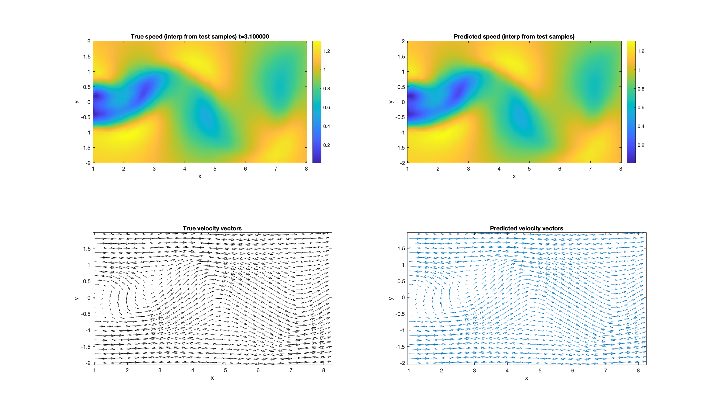
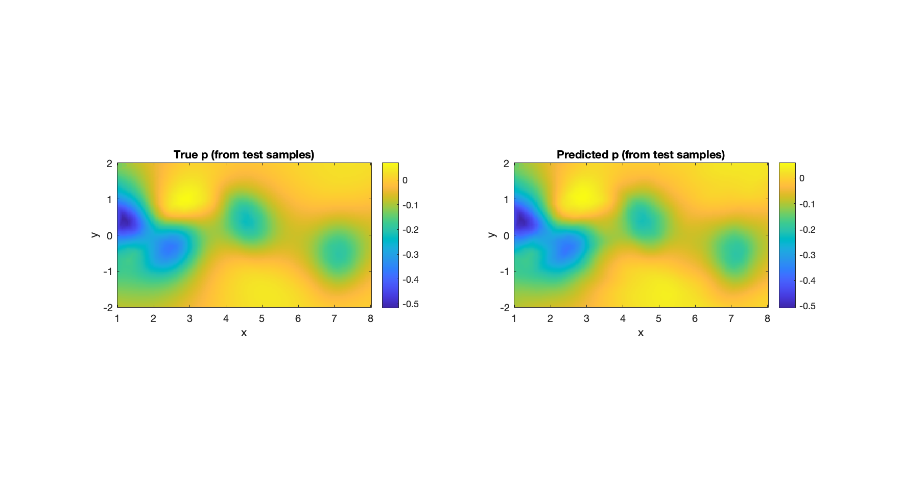
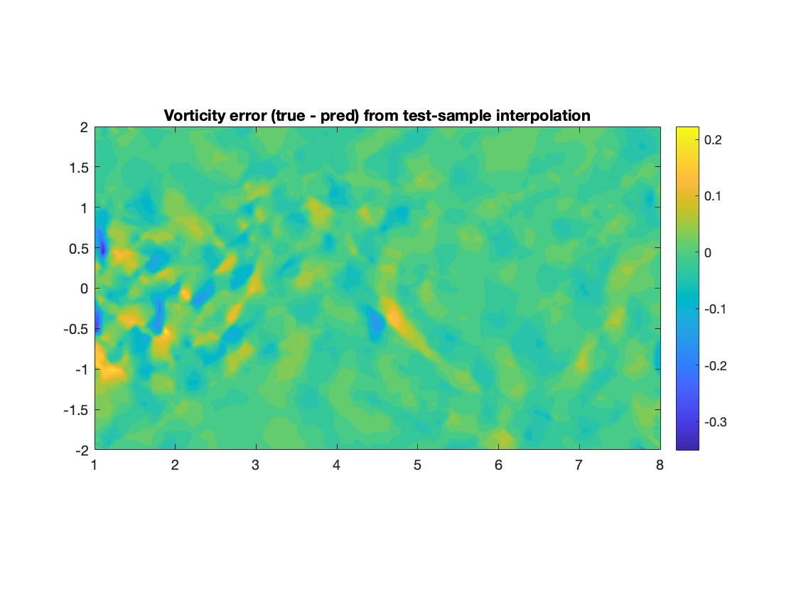

# PINN_Fluids

Welcome to the PINN_Fluids repository!

This project implements a Physics-Informed Neural Network (PINN) in MATLAB to solve the 2D incompressible Navier-Stokes equations. Instead of just learning from data, the model also learns the underlying physics of fluid flow, making it more accurate and generalizable.

We train the model using simulation data of flow past a cylinder, and the network learns to predict velocity (u, v) and pressure (p) fields, while also discovering the fluid’s viscosity.

----------------------------

## What's Inside

### PINN_Train_NN.m

This is the main script where everything starts.

- Loads the flow simulation data from `cylinder_nektar_wake.mat`
- Normalizes the inputs and outputs
- Builds a deep neural network with 5 hidden layers
- Trains the model in two stages:
  - First using **Adam** optimizer for fast learning
  - Then using **L-BFGS** for fine-tuning the results
- Learns not only velocity and pressure but also the fluid viscosity as a trainable parameter
- Prints training progress, losses, and updates at every step

- Run this script first to train your PINN.

----------------------------------------

### PINN_Visualization.m

This script helps you check how good the trained model is.

- Loads the trained model from `trained_PINN_LBFGS.mat`
- Predicts velocity and pressure for a selected time snapshot
- Visualizes:
  - Velocity magnitude (true vs predicted)
  - Velocity vector fields
  - Pressure field
  - Vorticity difference between prediction and ground truth
- Also prints R² scores for u, v, and p to show prediction accuracy

- Run this after training is done to see your model’s performance.

-----------------------------

### cylinder_nektar_wake.mat

This file contains the flow simulation data used for training.

It includes:
- Spatial coordinates (x, y)
- Time values
- Velocity components u and v
- Pressure values p

-------------------------------

### trained_PINN_LBFGS.mat

This file gets created after training. It saves:
- The trained neural network
- The learned viscosity value
- The normalization statistics used during training

This is the file used by `PINN_Visualization.m` to make predictions.

------------------------------

## Why This Project?

The goal is to show how neural networks can learn physics — not just data.

By incorporating the Navier-Stokes equations into the training process, the model can generalize better, especially when data is noisy or sparse.
PINNs are a powerful approach for scientific machine learning, and this project demonstrates that using fluid flow as an example.

-------------------------------

The following figures show model performance on a selected time snapshot of the flow field:

### Velocity Magnitude (True vs Predicted)

---

### Velocity Vectors (True vs Predicted)

---

### Pressure Magnitude (True vs Predicted)

---

### Vorticity Difference (True - Predicted)

-----------------------------

The final learned viscosity is 0.005967 for iterations in code.

